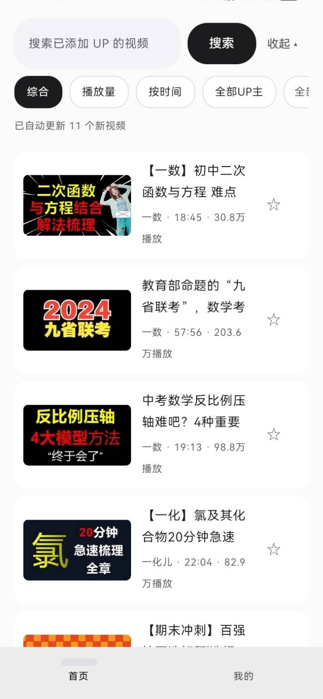
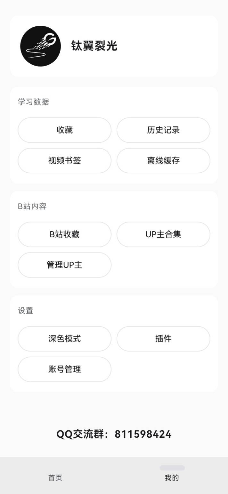
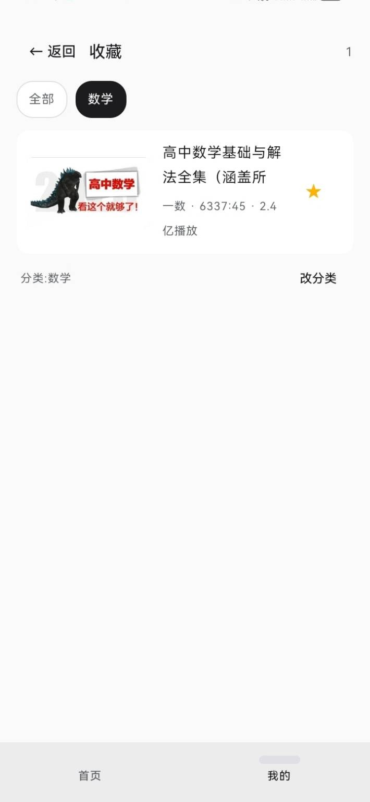
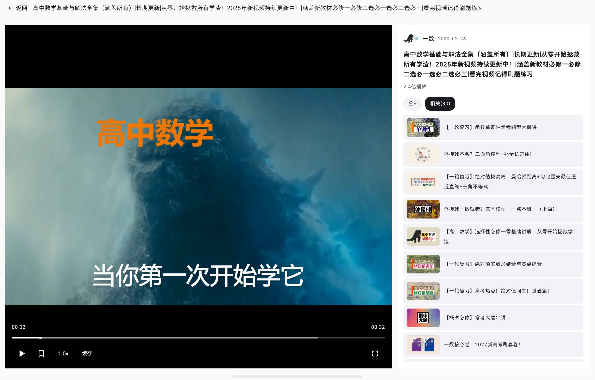
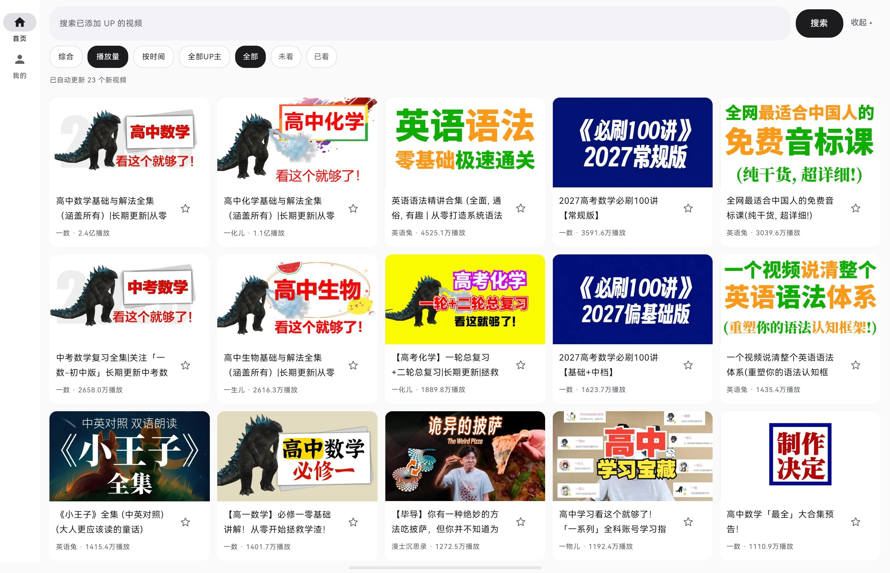

# BiliLite 界面预览

## 手机端效果

<table>
  <tr>
    <td align="center"> <b>首页</b> 视频列表 · 搜索筛选</td>
    <td align="center"> <b>我的</b> 个人中心 · 收藏/历史</td>
    <td align="center"> <b>收藏页</b> 收藏视频列表</td>
  </tr>
</table>

## 平板端效果

<table>
  <tr>
    <td align="center"> <b>视频播放页</b> 播放器 + 分P/章节列表</td>
    <td align="center"> <b>首页(横屏)</b> 网格布局视频列表</td>
  </tr>
</table>
